# Category Hierarchy

## Summary

- **Total Categories:** 78
- **Root Categories:** 18
- **Subcategories:** 60

---

## Category Tree Structure

```
📦 Batteries

📦 CCTV
  ├─ CCTV Accessories
  ├─ Dahua Cameras
  ├─ DVR
  ├─ Hikvision
  ├─ Hikvision Cameras
  ├─ NVR
  └─ WiFi Cameras

📦 Computer Accessories
  ├─ Desktop Accessories
  ├─ Keyboards
  ├─ Monitors
  └─ Mouse

📦 Fiber Equipment
  ├─ Fiber Accessories
  ├─ Fiber Patch Cords
  ├─ Media Converters
  └─ Splitters

📦 Installation Materials
  ├─ Fasteners
  ├─ Safety Equipment
  └─ Tension Hardware

📦 Laptops & Computers

📦 Mounting Hardware
  ├─ Antenna Equipment
  └─ TV Mounts

📦 Network Accessories
  ├─ Cable Management
  ├─ Faceplates
  ├─ Joiners
  ├─ Keystone Jacks
  ├─ Network Boxes
  ├─ Patch Panels
  └─ RJ45 Connectors

📦 Network Cables
  ├─ CAT5e Cables
  ├─ CAT6 Cables
  └─ Fiber Cables

📦 Networking Tools

📦 Network Switches
  ├─ Netis
  ├─ PoE Accessories
  ├─ PoE Switches
  ├─ Tenda
  └─ TP-Link

📦 PoE Equipment
  └─ PoE Devices

📦 Power
  ├─ Adapters
  ├─ Extension Cables
  ├─ PDU
  ├─ UPS
  └─ Voltage Guards

📦 Routers
  ├─ Mercusys
  ├─ Netis
  ├─ Tenda
  ├─ TP-Link
  └─ XPON Routers

📦 Smart TV
  ├─ Accessories
  ├─ Android TV Boxes
  └─ TV Streaming

📦 Storage
  ├─ Flash Storage
  ├─ Hard Drives
  ├─ Memory Cards
  └─ SSD

📦 Washing Machine Accessories
  ├─ Cleaning Products
  ├─ Inlet Hoses
  ├─ Outlet Hoses
  └─ Shock Pads

📦 Wireless
  └─ Access Points
     ├─ Tenda
     └─ TP-Link
```

---

## Visual Tree Diagram

```mermaid
graph TD
  7866b728-23fa-4ced-8167-8c44f039f940["Batteries"]
  f6c9425b-9b43-490f-b21d-cedc1615d923["CCTV"]
  f6c9425b-9b43-490f-b21d-cedc1615d923 --> 2f9618a5-ecb6-4440-a1b8-362009f172ea["CCTV Accessories"]
  f6c9425b-9b43-490f-b21d-cedc1615d923 --> ff635e60-9747-4382-94c5-0bf852948c30["Dahua Cameras"]
  f6c9425b-9b43-490f-b21d-cedc1615d923 --> ca01c08d-f4fc-4f47-b35c-32ad61a676b7["DVR"]
  f6c9425b-9b43-490f-b21d-cedc1615d923 --> 320c363b-f1c3-4da9-97ca-4dda9e9ad98d["Hikvision"]
  f6c9425b-9b43-490f-b21d-cedc1615d923 --> b677c2a0-0355-4042-9055-a2dead88dccb["Hikvision Cameras"]
  f6c9425b-9b43-490f-b21d-cedc1615d923 --> 8a908f57-f006-4205-8dda-d637280b2091["NVR"]
  f6c9425b-9b43-490f-b21d-cedc1615d923 --> cc7fc253-fb16-4c32-975f-57464590ab07["WiFi Cameras"]
  374aa37c-b67b-4642-a114-e312c0cfe0d0["Computer Accessories"]
  374aa37c-b67b-4642-a114-e312c0cfe0d0 --> 2098279e-f003-4833-a291-343c8f382f5f["Desktop Accessories"]
  374aa37c-b67b-4642-a114-e312c0cfe0d0 --> 767ddb62-9438-4d50-adda-9516d254c493["Keyboards"]
  374aa37c-b67b-4642-a114-e312c0cfe0d0 --> ede5ef6c-927e-47eb-84c1-1d3a019209c3["Monitors"]
  374aa37c-b67b-4642-a114-e312c0cfe0d0 --> 548db4c5-0fea-42a9-afc9-b205b6b628f4["Mouse"]
  682bd284-9c92-47ad-b0a2-a4db775950cf["Fiber Equipment"]
  682bd284-9c92-47ad-b0a2-a4db775950cf --> 8fa6bc09-d92b-467b-90c1-ae290b791424["Fiber Accessories"]
  682bd284-9c92-47ad-b0a2-a4db775950cf --> 59f63e2a-2b09-4084-8719-03e0bc6e23e5["Fiber Patch Cords"]
  682bd284-9c92-47ad-b0a2-a4db775950cf --> e7d9a64a-ae84-4081-a750-25841f4af615["Media Converters"]
  682bd284-9c92-47ad-b0a2-a4db775950cf --> dce57d7b-01c9-4c62-b400-5f0a49aeec65["Splitters"]
  7af8b108-52ff-43a2-9257-568cca6f651f["Installation Materials"]
  7af8b108-52ff-43a2-9257-568cca6f651f --> a2684261-b447-4515-9c88-da30df83c378["Fasteners"]
  7af8b108-52ff-43a2-9257-568cca6f651f --> c9d9b9d8-3f37-402d-afbf-66a477c2e004["Safety Equipment"]
  7af8b108-52ff-43a2-9257-568cca6f651f --> c99782aa-92ac-450f-93e7-2c4387fdaf88["Tension Hardware"]
  fcc48a00-6011-489a-b28c-c0885b8195fe["Laptops & Computers"]
  71452644-ab85-41a6-8f08-c7e1c06ea5d4["Mounting Hardware"]
  71452644-ab85-41a6-8f08-c7e1c06ea5d4 --> a36119b6-be13-482f-9c1b-e4fefd33b3ff["Antenna Equipment"]
  71452644-ab85-41a6-8f08-c7e1c06ea5d4 --> 5eaf88f3-ef6b-40da-afc9-3671bf863712["TV Mounts"]
  c85a2520-c3f8-4e56-a03a-691022a16ce3["Network Accessories"]
  c85a2520-c3f8-4e56-a03a-691022a16ce3 --> 86132338-55f0-4348-b720-090ef9ca3d12["Cable Management"]
  c85a2520-c3f8-4e56-a03a-691022a16ce3 --> 2556a310-11d4-44e6-a19e-1658a7500f2a["Faceplates"]
  c85a2520-c3f8-4e56-a03a-691022a16ce3 --> 02c96188-024b-42f3-9d9f-1eb32602ffda["Joiners"]
  c85a2520-c3f8-4e56-a03a-691022a16ce3 --> 51f90922-9fb2-415a-901e-2ed40d388269["Keystone Jacks"]
  c85a2520-c3f8-4e56-a03a-691022a16ce3 --> c7fbd163-9072-465a-8b0f-a9283f2f3cb6["Network Boxes"]
  c85a2520-c3f8-4e56-a03a-691022a16ce3 --> d6eac4b7-ad86-4273-b16d-66c534468939["Patch Panels"]
  c85a2520-c3f8-4e56-a03a-691022a16ce3 --> 48862f42-13bf-4268-aa24-ef351f0bfec0["RJ45 Connectors"]
  c91e0097-3cb2-4ae3-988f-3650cc8f725b["Network Cables"]
  c91e0097-3cb2-4ae3-988f-3650cc8f725b --> 8644c599-1757-4bf9-8409-7f85479ece72["CAT5e Cables"]
  c91e0097-3cb2-4ae3-988f-3650cc8f725b --> f659d97a-e122-4ab2-9a8d-0284bf19b0e5["CAT6 Cables"]
  c91e0097-3cb2-4ae3-988f-3650cc8f725b --> 98b73748-0328-43c3-b470-0d5ec22cd5c4["Fiber Cables"]
  8910e0d3-8f56-4f55-8df5-a923921d395a["Networking Tools"]
  eec1f07f-6d5e-4b00-902b-52ac9f215ccf["Network Switches"]
  eec1f07f-6d5e-4b00-902b-52ac9f215ccf --> 0aac3e8f-4715-4d97-be1a-afee302c2ed3["Netis"]
  eec1f07f-6d5e-4b00-902b-52ac9f215ccf --> a9fe0ee1-7743-4418-b553-7f7c03808bad["PoE Accessories"]
  eec1f07f-6d5e-4b00-902b-52ac9f215ccf --> 327f83ab-9dc9-4d1f-8352-996a8e0141ab["PoE Switches"]
  eec1f07f-6d5e-4b00-902b-52ac9f215ccf --> 87492dda-bce2-45aa-a72e-9964a81d2bdf["Tenda"]
  eec1f07f-6d5e-4b00-902b-52ac9f215ccf --> c9c009f9-a4b5-47c4-9a1d-485a65f899c7["TP-Link"]
  eaed94a0-38de-498c-a68c-547dcb7ff20b["PoE Equipment"]
  eaed94a0-38de-498c-a68c-547dcb7ff20b --> fde948e4-a574-4ed1-a25c-7a10fc3cb9eb["PoE Devices"]
  2601479b-e492-4bf6-bb50-9385588ef929["Power"]
  2601479b-e492-4bf6-bb50-9385588ef929 --> d755d9fb-0f9d-419f-969c-e9d0ec6ce452["Adapters"]
  2601479b-e492-4bf6-bb50-9385588ef929 --> 8fbd4320-61ef-4edf-8468-59639a6d04d2["Extension Cables"]
  2601479b-e492-4bf6-bb50-9385588ef929 --> 7b3de378-7283-42b1-bef5-6e4f192bd760["PDU"]
  2601479b-e492-4bf6-bb50-9385588ef929 --> 79ac4b28-8460-47bc-87f4-ccdf519e1691["UPS"]
  2601479b-e492-4bf6-bb50-9385588ef929 --> 7d5099a0-b4f8-4833-951f-1a0a45ef1f0e["Voltage Guards"]
  9e0b4774-b6de-4969-9b12-a2fcd8e7a17b["Routers"]
  9e0b4774-b6de-4969-9b12-a2fcd8e7a17b --> 2669a57c-b051-407c-8b4d-f7ad83bf5fd2["Mercusys"]
  9e0b4774-b6de-4969-9b12-a2fcd8e7a17b --> 4ef7dac1-d45e-47a2-9062-016d8f6506c8["Netis"]
  9e0b4774-b6de-4969-9b12-a2fcd8e7a17b --> 18e837bf-3404-4016-a809-e90bf844df9c["Tenda"]
  9e0b4774-b6de-4969-9b12-a2fcd8e7a17b --> 0f0c943b-c54d-4c20-93bd-80040540fd15["TP-Link"]
  9e0b4774-b6de-4969-9b12-a2fcd8e7a17b --> 5070fa4c-2313-43f0-b5c9-57404ba10ba8["XPON Routers"]
  94396e8d-d6a1-40c6-a251-0f50eb65abcd["Smart TV"]
  94396e8d-d6a1-40c6-a251-0f50eb65abcd --> e718f4cf-c48c-4434-9206-ae1d142884e7["Accessories"]
  94396e8d-d6a1-40c6-a251-0f50eb65abcd --> f463b8e5-8acf-42bd-bdb0-512984fa00c4["Android TV Boxes"]
  94396e8d-d6a1-40c6-a251-0f50eb65abcd --> 061e6c85-62be-4849-b55a-661e247273bc["TV Streaming"]
  46ae25d6-8737-4f12-bf03-dc641d8a82a3["Storage"]
  46ae25d6-8737-4f12-bf03-dc641d8a82a3 --> 40281781-8765-4410-9ba2-b50e9fe4ca95["Flash Storage"]
  46ae25d6-8737-4f12-bf03-dc641d8a82a3 --> 17965cbd-d64e-4698-96cf-9aec7f6d3c84["Hard Drives"]
  46ae25d6-8737-4f12-bf03-dc641d8a82a3 --> 7331b2e7-6f7b-4a7e-972c-671b31e81b53["Memory Cards"]
  46ae25d6-8737-4f12-bf03-dc641d8a82a3 --> b7428a8e-a22b-42b0-9cd9-2bd4be10b087["SSD"]
  b8c63a9f-f928-4206-8769-13eb494fd118["Washing Machine Accessories"]
  b8c63a9f-f928-4206-8769-13eb494fd118 --> bb64eb8e-fd0f-4bae-9cd8-524c3a693230["Cleaning Products"]
  b8c63a9f-f928-4206-8769-13eb494fd118 --> a0a6f79f-6036-46ce-85f8-7ae7073895ce["Inlet Hoses"]
  b8c63a9f-f928-4206-8769-13eb494fd118 --> 37f52f50-cc6d-4f0a-8a6a-5f4ea2b41aeb["Outlet Hoses"]
  b8c63a9f-f928-4206-8769-13eb494fd118 --> 99de6f30-d0f8-4cda-8e87-90ebd09f9c8f["Shock Pads"]
  f4ea87c1-e872-4b22-b54c-a6dac0a96aec["Wireless"]
  f4ea87c1-e872-4b22-b54c-a6dac0a96aec --> 5c3e5bf9-f63c-4b84-92d5-9cd20e62cd1e["Access Points"]
  5c3e5bf9-f63c-4b84-92d5-9cd20e62cd1e --> bb64eb8e-fd0f-4bae-9cd8-524c3a693230["Tenda"]
  5c3e5bf9-f63c-4b84-92d5-9cd20e62cd1e --> a0a6f79f-6036-46ce-85f8-7ae7073895ce["TP-Link"]
```



---

## Root Categories

1. **Batteries** - No subcategories
2. **CCTV** - 7 subcategories
3. **Computer Accessories** - 4 subcategories
4. **Fiber Equipment** - 4 subcategories
5. **Installation Materials** - 3 subcategories
6. **Laptops & Computers** - No subcategories
7. **Mounting Hardware** - 2 subcategories
8. **Network Accessories** - 7 subcategories
9. **Network Cables** - 3 subcategories
10. **Networking Tools** - No subcategories
11. **Network Switches** - 5 subcategories
12. **PoE Equipment** - 1 subcategory
13. **Power** - 5 subcategories
14. **Routers** - 5 subcategories
15. **Smart TV** - 3 subcategories
16. **Storage** - 4 subcategories
17. **Washing Machine Accessories** - 4 subcategories
18. **Wireless** - 1 subcategory (Access Points with 2 sub-items)
