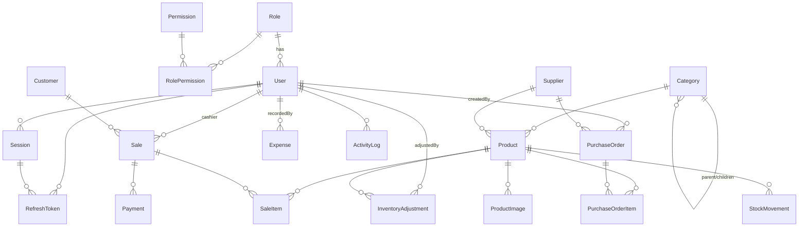

# TechStock Database

PostgreSQL, modelled with Prisma (`src/prisma/schema.prisma`). 21 models.

## Conventions

Every syncable table carries:

| Field         | Type       | Purpose                                        |
| ------------- | ---------- | ---------------------------------------------- |
| `id`          | `uuid` PK  | Primary key.                                   |
| `createdAt`   | timestamp  | Row creation.                                  |
| `updatedAt`   | timestamp  | Last modification — conflict-resolution clock. |
| `syncVersion` | int        | Bumped on every write (offline sync).          |
| `deviceId`    | text?      | Originating device (offline sync).             |
| `isDeleted`   | bool       | Soft-delete / tombstone flag.                  |
| `deletedAt`   | timestamp? | When soft-deleted.                             |

Money is `Decimal(14,2)`. Tax rates are `Decimal(5,2)` percentages.

## Entity–Relationship Diagram

## Tables

| Table                   | Purpose                                                    |
| ----------------------- | --------------------------------------------------------- |
| `roles`                 | RBAC roles (ADMIN/MANAGER/CASHIER; `isSystem`).           |
| `permissions`           | Fine-grained capabilities (e.g. `sale:create`).           |
| `role_permissions`      | Role↔permission join.                                     |
| `users`                 | Staff accounts; belong to one role.                       |
| `sessions`              | Login sessions; revocable for instant logout.             |
| `refresh_tokens`        | Hashed, rotating refresh tokens bound to a session.       |
| `categories`            | Product categories (self-referencing tree).               |
| `suppliers`             | Vendors; `outstandingBalance` owed to them.               |
| `products`              | Catalog: SKU, barcode, QR, serial, 4 price tiers, stock.  |
| `product_images`        | Product images (`isPrimary`, `position`).                 |
| `customers`             | Customers; `outstandingBalance`, `loyaltyPoints`.         |
| `purchase_orders`       | POs with lifecycle status and totals.                     |
| `purchase_order_items`  | PO line items; `receivedQuantity` tracks receiving.       |
| `sales`                 | Sales/receipts; totals, `costTotal` (COGS), status.       |
| `sale_items`            | Sale lines; snapshot name/sku + `returnedQuantity`.       |
| `payments`              | Tenders against a sale (negative = refund).               |
| `expenses`              | Business expenses (feed profit reports).                  |
| `stock_movements`       | Immutable stock ledger (`stockBefore`/`stockAfter`).      |
| `inventory_adjustments` | Manual stock corrections with reason & reference.         |
| `activity_logs`         | Audit trail of security/business actions.                 |
| `settings`              | Key/value store config (`isPublic` flag).                 |

## Enums

- `StockMovementType`: SALE, PURCHASE, RETURN, DAMAGE, ADJUSTMENT, TRANSFER
- `SaleStatus`: COMPLETED, CANCELLED, RETURNED, PARTIALLY_RETURNED
- `PaymentMethod`: CASH, CARD, MOBILE_MONEY, BANK_TRANSFER, CREDIT, OTHER
- `PaymentStatus`: PAID, PARTIAL, UNPAID, REFUNDED
- `PurchaseOrderStatus`: DRAFT, ORDERED, PARTIALLY_RECEIVED, RECEIVED, CANCELLED
- `AdjustmentReason`: STOCK_COUNT, DAMAGE, THEFT, EXPIRY, CORRECTION, OTHER
- `SettingType`: STRING, NUMBER, BOOLEAN, JSON

## Referential integrity

- `Restrict` on `products→supplier`? No — `SetNull` (a supplier can be removed
  without orphaning products). Sales/POs use `Restrict` on user/supplier so
  historical documents can't lose their actor.
- `Cascade` on children of a parent document (sale items, PO items, payments,
  product images, sessions, refresh tokens).
- `SetNull` on optional references (product category/supplier, sale customer,
  activity-log user).
